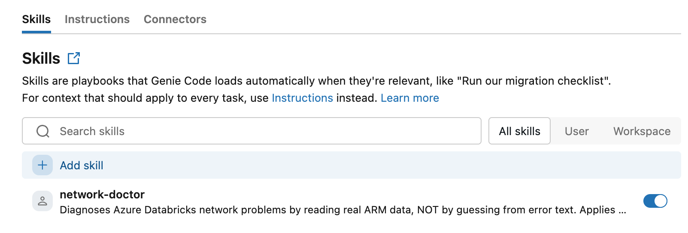
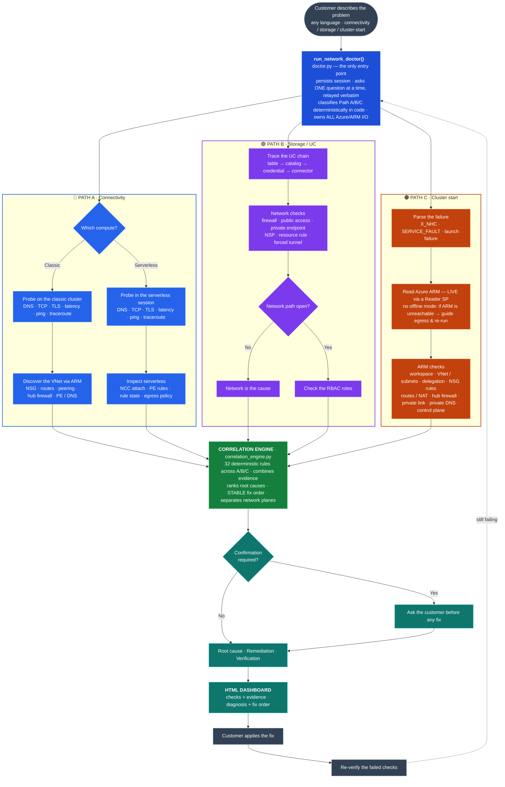

# Network Connectivity Doctor

**Your Databricks cluster can't reach something, or won't start at all — and the error
message doesn't tell you why. This finds the actual cause in your Azure network.**

Azure Databricks network failures are hard because the cause is almost never where the
error points. A `PERMISSION_DENIED` on a storage read is usually not a permissions
problem. A cluster that dies during startup is usually not a Databricks bug. The real
cause is buried a few layers away — an NSG rule, a route table, a firewall in a peered
hub, a Private DNS zone that was never linked, a serverless egress policy — and finding
it by hand means clicking through a dozen Azure blades in the right order.

Network Doctor reads your **actual** Azure configuration and network path, and tells you
which layer is broken, why, and the command to fix it. It does not guess from your error
text.

You install it into your own Databricks workspace, then describe the problem in your own
words, in a chat, in any language. It asks you one question at a time and finishes with a
report you can hand to whoever owns your Azure network.

**→ [Install it in your workspace](#install-it-in-your-workspace)** — clone this repository
in as a Databricks Git folder. About three minutes, no CLI, screenshots included.

### What using it looks like

> **You:** my cluster won't start, it fails with a network configuration error
>
> **Network Doctor:** What is the workspace's full ARM resource id? *(Azure Portal → your
> workspace → Properties → Resource ID)*
>
> **You:** `/subscriptions/…/providers/Microsoft.Databricks/workspaces/my-workspace`
>
> **Network Doctor:** For the Azure checks I need a service principal with **Reader**,
> stored in Databricks Secrets. What is the name of the secret scope?
>
> *…a few questions later:*
>
> **Root cause — Forced-Tunnel Firewall Is Missing Required Databricks Egress**
> (CRITICAL · blocking). Firewall `fw-hub` is in the forced-tunnel path and does not
> permit the Databricks control-plane egress your cluster needs to boot.
> **Fix:** on firewall policy `afwp-hub`, add an ALLOW rule for the data-plane subnets…

For a connectivity or storage problem, the first question is how far you want it to go —
and one of the two answers needs no Azure credential at all:

> **You:** my cluster can't reach sql01.corp.internal on port 1433
>
> **Network Doctor:** Before I start, one choice — how far should I go? **`simple`** tests
> the network path itself and needs **no Azure credential** (just which compute, and a
> cluster to run the probes from). **`deep`** also reads your Azure network configuration —
> firewall rules, routing, NSGs, peering, private DNS, private endpoints — to name the exact
> object at fault; that needs your workspace's Azure resource id and a read-only credential.
>
> **You:** deep, but I don't have a service principal
>
> **Network Doctor:** No problem — here is how to create it *(four CLI commands you run in
> your own terminal; the values never touch this chat)* …

Answering `simple` is a real answer, not a half-measure: the report names every layer it
could not check. Once the credential exists you run the deep analysis as a fresh
conversation. One caveat worth knowing up front: on a **storage / Unity Catalog** error,
almost everything that decides the outcome — the storage account's firewall, its network
perimeter, the role assignments — is read from Azure, so `simple` there tells you what it
ruled out rather than naming a cause.

It is a [Genie Code](https://docs.databricks.com/aws/en/genie-code/) **skill**: a set of
instructions plus deterministic Python that runs inside your own notebook. There is no
separate service to run, no infrastructure to provision, no data to move.

---

## What it diagnoses

It classifies your problem automatically, in any language, into one of three paths:

- **Path A — Connectivity.** A cluster or serverless warehouse can't reach a data source: timeout, DNS failure, "cannot connect", `UnknownHostException`, Lakehouse Federation / JDBC failures.
- **Path B — Storage / UC access.** `PERMISSION_DENIED`, `AbfsRestOperationException`, "request not authorized", a `SELECT` on a UC Volume or external table failing — **especially** when it works on one compute type and fails on the other (that asymmetry is a network signature, not an RBAC one).
- **Path C — Cluster start / NHC.** A VNet-injected cluster can't bootstrap: `X_NHC_*`, "Network configuration failure", "Add nodes failed", `SERVICE_FAULT` / `X_UnexpectedLaunchFailure` launch errors.

Root causes are buried across layers — VNets, NSGs, route tables, firewalls, Private Endpoints, DNS zones, NCC configurations. **This tool automates the whole sweep — and reasons about what to check next based on what it finds.**

---

## Install it in your workspace

Network Doctor is a **skill**: a folder that [Genie Code](https://docs.databricks.com/aws/en/genie-code/)
reads. So installing it means putting this repository in the place Genie Code looks — which
you do by **cloning it in as a Databricks Git folder**. No CLI, no script, nothing to copy
file by file, and updating later is a `Pull`.

**About three minutes**, and you can do it yourself if you can open a notebook. You do not
need to be a workspace admin.

### 1. Find where Genie Code keeps skills

In the **Workspace** browser, open your own user folder and go into `.assistant` → `skills`.
It starts with a dot but it is an ordinary folder — visible, and you can click straight into
it:


Anything in `skills/` is a skill Genie Code can read. Network Doctor will be one folder in
here, and it touches nothing else in your workspace.

### 2. Clone this repository in as a Git folder

Standing **inside** `.assistant/skills`, click **Create** → **Git folder**:


The Git folder is created wherever you are standing, so being inside `skills/` before you
click is the whole trick.

| Field | Value |
|---|---|
| **Git repository URL** | this repository's `.git` URL |
| **Git provider** | GitHub |
| **Git folder name** | `network-doctor` — **exactly this**; it is part of the path the skill resolves |


Leave **Sparse checkout mode** off, then **Create Git folder**. You end up with:

```
/Workspace/Users/<you>/.assistant/skills/network-doctor/
├── SKILL.md          the instructions Genie Code follows
├── reference/        four documents it opens as needed
└── scripts/          twelve Python modules — the diagnostic engine
```

**Nothing else is written anywhere** — no tables, no schemas, no jobs, no clusters at
install time.

> **While this repository is private**, your workspace needs a Git credential that can read
> it: your name, top-right → **Settings** → **Linked accounts** → **Git integration**. That
> is standard Databricks Git folder setup, stored per-user by Databricks; Network Doctor
> never sees it.

### 3. Describe your problem — that is the whole interface

Open any Python notebook, click the **sparkle icon** top-right to open Genie Code, and say
what is wrong, in any language:

> "my classic cluster can't reach sql01.corp.internal on port 1433"

**You do not name the skill, mention a file, or paste a path.** Genie Code finds a skill
sitting in `.assistant/skills/` by itself:


From there it asks **one question at a time** and finishes with the diagnosis **as text in
the chat**. That text is the deliverable: the cause, the fix, the checks that failed, and
every layer it could not check. It also saves an HTML dashboard and a JSON report under
`/Workspace/Users/<you>/network_doctor_reports/` — but if the notebook cell that draws the
dashboard fails to render, you have lost nothing.

### Confirming the skill is enabled

Cloning registers Network Doctor automatically — it shows up under **Genie Code →
Customizations → Skills** as a **User** skill, already enabled. You do not add it by hand.
If its toggle is ever off it will not load, so switch it back on here. This panel is also
where **Add skill** lets you register other skills, by name or by folder path.



### Updating, and removing

**Updating** is a `Pull` on the Git folder. Then start a **fresh** Genie Code conversation —
an open session may still hold the previous instructions.

**Removing** it is deleting the Git folder. There is nothing else to undo: no tables, no
schemas, no jobs, and no cluster to clean up, because Network Doctor never creates compute.
Reports you asked it to save stay in `network_doctor_reports/` until you delete them.

---

## If it does not activate

| What you see | Why | What to do |
|---|---|---|
| No sparkle icon in the notebook | Genie Code isn't enabled for this workspace | Ask your workspace administrator to enable it |
| `No Git credential configured` when creating the Git folder | The repository is private and your workspace has no token for it | The note in step 2 |
| It answers with "possible causes" instead of asking you a question | Genie Code did not find the skill | Check the folder is at `.assistant/skills/network-doctor` (that exact name) with `SKILL.md` at its top level, not inside a subfolder. Then start a new conversation |
| It says it can't load the diagnostic scripts | `scripts/` is not where the skill expects it, or the conversation predates the clone | Confirm the layout in step 2, then start a new conversation |

---

## Architecture

A single driver — **`run_network_doctor()`** — is the only entry point. It deterministically classifies the problem (Path A/B/C) **in code**, asks the right intake questions, runs the matching check suite, correlates the results into a ranked diagnosis, and renders an HTML dashboard. The model's role is narrow: relay the driver's questions and present its findings — it never guesses the cause and never makes ad-hoc/direct Azure calls.



---

## Diagnostic capabilities

### Network probes — Path A (classic compute)

Executed from the cluster node, on the same network path as real workloads:

| Check | What it verifies |
|---|---|
| **DNS Resolution** | Hostname resolves? To which IPs? |
| **TCP Connectivity** | Port reachable? Timeout, refused, or connected? |
| **TLS Handshake** | Certificate valid? Issuer? Protocol? |
| **Traceroute** | Where do packets drop? (only when TCP fails) |
| **Latency** | Round-trip time — avg, P95 over 10 samples |
| **Ping** | ICMP reachability (informational) |

### Azure infrastructure checks (requires a Service Principal via Databricks Secrets)

| Check | What it verifies |
|---|---|
| **NSG Rules** | Outbound deny rules blocking the target port? |
| **Route Table (UDR)** | Correct next-hop? Blackhole? NVA? Internet? |
| **VNet Peering** | Connected? Allow Forwarded Traffic enabled? |
| **Private Endpoints** | PE exists? Approved? Active? |
| **Private DNS Zones** | Zone linked to the Databricks VNet? |

### Serverless NCC checks (requires Account ID)

| Check | What it verifies |
|---|---|
| **NCC Attached?** | Workspace has a Network Connectivity Config? |
| **PE Rule / Egress** | Private-endpoint rule (or egress policy) for the target? |
| **Rule State** | ESTABLISHED / PENDING / REJECTED? |

### Storage / UC access checks — Path B (requires a Service Principal)

| Check | What it verifies |
|---|---|
| **Storage Firewall** | `publicNetworkAccess` Disabled? `defaultAction` Deny? VNet/IP rules? |
| **Private Endpoint** | A storage (dfs/blob) PE that gives a private path? |
| **Network Security Perimeter** | NSP present? Enforced vs Learning mode? |
| **Credential chain** | table → catalog → storage credential → access connector |

Network is checked **before** RBAC — if there is no network path, role assignments are irrelevant.

### Cluster-start / NHC checks — Path C (requires a Service Principal)

| Check | What it verifies |
|---|---|
| **NHC error parse** | Machine and prose NHC signatures → classifies the failure |
| **Subnet validation** | Databricks delegation, NSG required rules, route table, NAT |
| **`requiredNsgRules`** | `AllRules` vs `NoAzureDatabricksRules` (back-end PL alternative) |
| **ARM reachability** | Read LIVE via the SP; if the runtime can't reach ARM, it guides you to enable egress and re-run (no offline mode) |

---

## Requirements

- **Azure Databricks workspace**, with **Genie Code** available (the sparkle icon in a
  notebook). If you do not have that icon, there is nothing for the skill to run in.
- **Permission to create a Git folder** in your own workspace user folder — which is
  ordinary workspace-user access, not admin. While this repository is private, a Git
  credential that can read it (Settings > Linked accounts).
- **A classic cluster you start** (for classic-compute Path A diagnostics). The probes must
  run from inside the workspace VNet, so they run on a cluster you provide — the tool asks for
  its id and **never creates, starts, stops or deletes compute**. A single-node cluster with a
  short auto-terminate is enough. Answer `none` to skip it and get the checks that need no
  in-VNet probe.
- **Foundation Model** endpoint for the conversational layer (defaults to Claude on Databricks; any [Foundation Model](https://docs.databricks.com/aws/en/machine-learning/foundation-models/) the workspace can reach works).
- *(Optional)* **Databricks-backed secret scope** with a read-only Azure Service Principal. `Reader` at the subscription scope is best; `Reader` per resource group/resource works with reduced coverage.
- *(Optional)* **Databricks Account ID** for serverless NCC checks.

---

## What it touches (for a security review)

The Network Doctor performs **read-only inspection of Azure infrastructure**: exclusively
`GET` requests to Azure Resource Manager for VNets, subnets, NSGs, route tables, peerings,
Private Endpoints, Private DNS zones, firewall policies and storage-account network
settings. **Nothing in Azure is ever created, modified or deleted.**

On the **Databricks** side it writes exactly one kind of thing:

- the **report**: an HTML dashboard plus a structured JSON file, saved under
  `/Workspace/Users/<you>/network_doctor_reports/`. The report contains check results,
  diagnoses and short excerpts of Azure API error text (topology metadata such as resource
  names, subnets and IP ranges) — never credentials.

**No compute is created.** Network Doctor never calls a clusters API. The classic probes run
on a cluster you started, addressed by the id you gave, via the Command Execution API — so
there is no billable resource the tool brings into being.

**Credentials.** Azure service-principal values are read from a Databricks-backed secret
scope **by key name only** and held in memory for the duration of the run. They are never
printed, logged, written to the report or the session file, or echoed into the chat. If you
paste a credential into the conversation, the skill is instructed to stop, not echo it, and
tell you to rotate it.

**Permissions required.** Azure **`Reader`** on the relevant subscription (or on the
individual resource groups, with reduced coverage) — never `Owner`, `Contributor` or
`User Access Administrator`. Standard Databricks workspace-user access. Databricks account
admin only for the optional serverless NCC checks.

**Data residency.** No data leaves your workspace and your Azure tenant. All Azure and
Databricks API calls appear in your own audit logs.

**Uninstall.** Delete the Git folder — see [Updating, and removing](#updating-and-removing).

---

## Project structure

```
├── SKILL.md                        # slim always-loaded core — the skill Genie Code reads
├── .assistant_instructions.md      # optional workspace-wide Genie Code preferences
├── reference/                      # progressive disclosure — opened on demand
│   ├── PATH_A_connectivity.md
│   ├── PATH_B_storage.md
│   ├── PATH_C_cluster_start.md
│   └── DIAGNOSTIC_MACHINERY.md
├── scripts/                        # the deterministic diagnostic engine
│   ├── doctor.py                   # run_network_doctor() — the single driver
│   ├── orchestrator.py             # DAG-based check execution
│   ├── correlation_engine.py       # 32 deterministic diagnosis rules
│   ├── models.py                   # Status, CheckResult, Severity, Diagnosis
│   ├── secret_utils.py             # Databricks Secrets helpers for Azure SP
│   ├── classic_probers.py          # DNS, TCP, TLS, traceroute, latency, ping
│   ├── azure_infra_checks.py       # NSG, routes, peering, PE, DNS zones (ARM)
│   ├── serverless_ncc_checks.py    # NCC attach / PE rules / egress
│   ├── storage_access_checks.py    # storage firewall, NSP, credential chain
│   ├── cluster_start_checks.py     # NHC parsing + subnet/NSG/route ARM checks
│   ├── topology.py                 # the network graph the diagnosis runs against
│   └── report_builder.py           # HTML dashboard generation
├── README.md                       # this file — what it is, and how to install it
├── CHANGELOG.md                    # the version in every report's footer
├── LICENSE.md
├── docs/
│   └── images/                     # the screens the install walkthrough shows
```

---

## Getting help with a result

The report is meant to be handed to whoever owns your Azure network — it names the
resource, the rule, and the command to change.

Two things worth knowing when you read one:

- **It tells you what it could not check.** Every report has a limits section. If a
  service principal was not provided, or a resource was outside its read scope, the
  affected layers are listed as unverified rather than quietly passed. A clean report
  with three unverified layers is not the same as a clean bill of health, and it says so.
- **It leads with the cause, and lists everything else below it.** If the top finding
  does not match what you are seeing, read the rest before acting: on a workspace with
  more than one misconfiguration, the ranking is a judgement about which one is blocking
  you now.

If a diagnosis looks wrong for your environment, the report's own check rows show which
Azure objects were read and what each returned, so it can be verified by hand.

## License

This project is provided under the Databricks License. See `LICENSE.md`.
